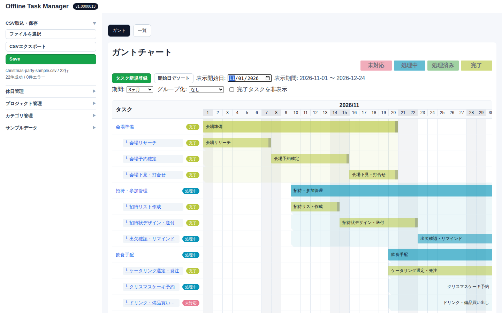

# taskManage

taskManage は、**ローカル完結・オフライン利用**を前提としたタスク管理 Web アプリです。  
CSV の取り込み、ガント表示、一覧確認、ローカル保存を中心に、軽量にタスク管理を行えます。

## サンプル画面

クリスマスパーティの準備をガントチャートで管理している例です。



> サンプルデータ: [`samples/christmas-party-sample.csv`](samples/christmas-party-sample.csv)

## 特徴

- ローカル CSV の取り込み
- タスクの一覧表示（ステータス別）
- ガントチャート表示
- ローカルストレージへの保存
- 配布用 ZIP の作成とローカル実行

## 動作環境

### 開発

- Node.js 24 系（推奨）
- npm
- （任意）Docker

### 配布版の実行

- Windows 11
- Python 3（`py` または `python` コマンドが利用可能）

## まずは配布 ZIP で使う（開発環境インストール不要）

Node.js や npm などの開発環境をインストールしなくても、
配布用 ZIP をダウンロードして展開すれば **Python 3 だけで実行** できます。

- ダウンロード: [最新の配布 ZIP を GitHub Releases から取得](https://github.com/7cancer/taskManage/releases/latest)
- 必要なもの: Windows 11 + Python 3（`py` または `python` が使えること）
- 実行手順: 本 README の「配布 ZIP の実行（Windows）」を参照

## セットアップ

```bash
npm install
```

## 開発サーバ起動

```bash
npm run dev -- --host 0.0.0.0
```

ブラウザで `http://localhost:5173` を開いて確認します。

## 主要スクリプト

- `npm run dev` : 開発サーバ起動
- `npm run build` : TypeScript + Vite ビルド
- `npm run typecheck` : 型チェック
- `npm run lint` : ESLint
- `npm run build:zip` : 配布用 ZIP 作成

## Docker で開発する場合（Windows PowerShell）

### 初回（依存関係インストール込み）

```powershell
docker run --rm -it `
  -v "${PWD}:/app" `
  -w /app `
  -p 5173:5173 `
  node:24-alpine sh -lc "npm install && npm run dev -- --host 0.0.0.0"
```

### 2回目以降

```powershell
docker run --rm -it `
  -v "${PWD}:/app" `
  -w /app `
  -p 5173:5173 `
  node:24-alpine sh -lc "npm run dev -- --host 0.0.0.0"
```

## 配布用 ZIP の作成

### ローカル環境で作成

```bash
npm install
npm run build:zip
```

### Docker で作成（Windows PowerShell）

```powershell
docker run --rm -it `
  -v "${PWD}:/app" `
  -w /app `
  node:24-alpine sh -lc "apk add --no-cache zip >/dev/null && npm install && npm run build:zip"
```

成功すると `release/taskManage-build.zip` が生成されます。

## 配布 ZIP の実行（Windows）

1. `release/taskManage-build.zip` を任意フォルダへ解凍
2. PowerShell で解凍先へ移動
3. `./run-local.cmd` を実行
4. ブラウザで `http://localhost:4173` を開く

## トラブルシューティング

- `localhost で接続が拒否されました` が出る場合は、数秒待って再読み込みしてください。
- `Python was not found ...` が出る場合は、`py -V` / `python --version` を確認し、必要に応じて Python 3 をインストールしてください。
- `set: line 2: illegal option -` が出る場合は、`scripts/create-build-zip.sh` の改行コードが CRLF の可能性があります。LF に変換して再実行してください。

## ドキュメント

- 要件定義: `docs/offline-task-manager-requirements-v1.0.md`
- ドメイン設計: `docs/architecture/domain-design.md`

